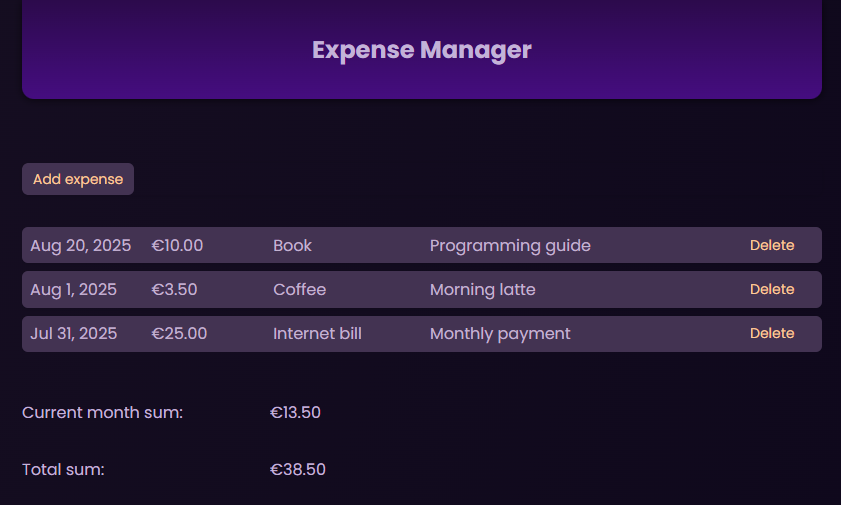
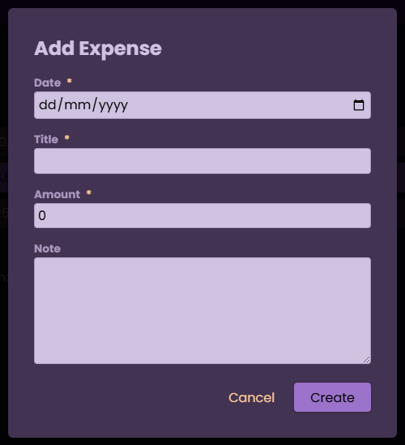
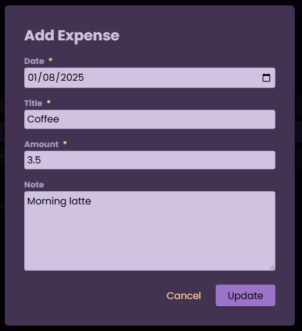

# ExpenseManager

A simple Angular application for expense management.
Allows you to add, edit, delete, and view expenses, as well as see their monthly total and overall sum.

# ExpenseManagerApp

This project was generated using [Angular CLI](https://github.com/angular/angular-cli) version 20.1.6.

## Installation and Running

1. Clone the repository:
```bash
git clone https://github.com/svetava/ExpenseManager.git
cd ExpenseManager
```

2. Install dependencies:
```bash
npm install
```

3. Start the local development server:
```bash
ng serve
```

Once the server is running, open your browser and navigate to `http://localhost:4200/`. The application will automatically reload whenever you modify any of the source files.

## Code scaffolding

Angular CLI includes powerful code scaffolding tools. To generate a new component, run:

```bash
ng generate component component-name
```

For a complete list of available schematics (such as `components`, `directives`, or `pipes`), run:

```bash
ng generate --help
```

## Building

To build the project run:

```bash
ng build
```

This will compile your project and store the build artifacts in the `dist/` directory. By default, the production build optimizes your application for performance and speed.

## How to use the app

1. **Main page**



2. To create a new expense, press the **"Add expense"** button. Then fill in all required fields in the new expense form.



3. You can edit an expense by clicking on the expense row. An edit form will open.



4. You can delete an expense by pressing the **"Delete"** button.


5. All expenses are shown in date order (from newest to oldest). At the bottom of the main page, you can see your current month’s expense total and the overall total.

## Future improvments

1. I decided to skip the back-end at this stage to focus on learning Angular and building a fully functional front-end first. 
If I were to add the back-end, I would implement it using Java with Spring Framework, exposing RESTful APIs for CRUD operations on expenses (create, read, update, delete). For storage, I would start with an in-memory structure like a List or Map. I would also enable CORS to allow the Angular frontend to consume the API using HttpClient and handle loading/error states.

The Angular front-end would communicate with the back-end via HTTP requests handled in Angular services, ensuring a clean separation of concerns and scalability for future features.

2. A calendar picker will be added to the main form to allow choosing a period for displaying expenses and their total.

3. A paginator will be added to the main form.

4. Expense category functionality will be added (to filter expenses by category).

5. The console error that appears when there are no expenses yet will be fixed (this error does not affect app functionality).

6. The state update approach will be changed from relying on Zone.js & Angular’s change detection mechanism to a more modern and efficient approach using Signals.

7. The @Output decorator will be replaced with the more modern output() function.